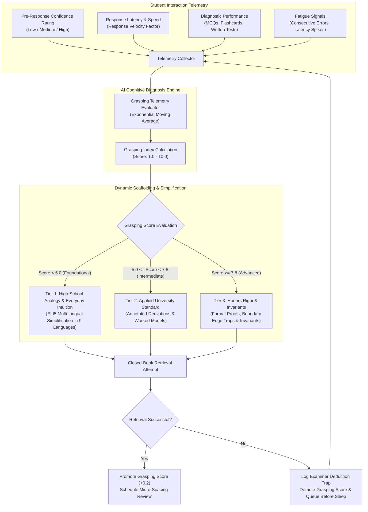
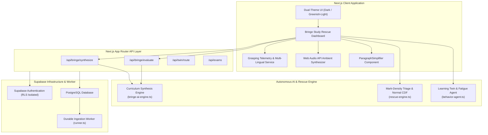
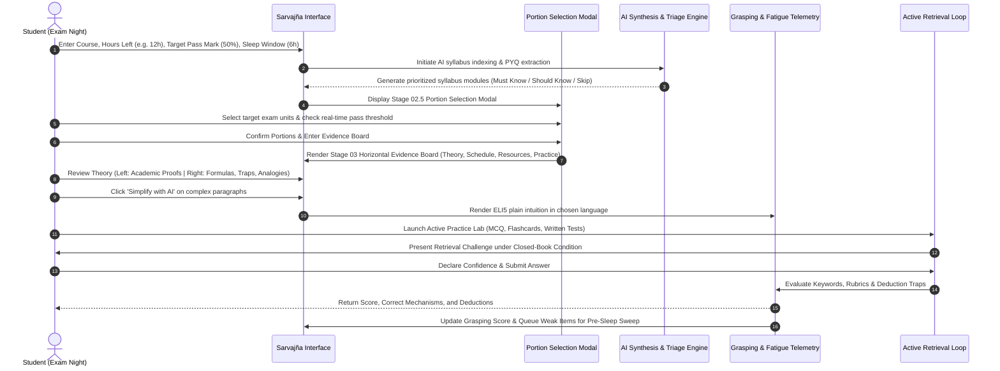

# Sarvajña: Adaptive Exam-Eve OS & Last-Minute Cognitive Grasping Engine

Sarvajña is an AI-directed, evidence-based learning operating system engineered specifically for high-stakes, last-minute university examination preparation. Rather than acting as a passive note generator or bloated textbook summarizer, Sarvajña functions as an active-recall cognitive copilot: it identifies high-yield syllabus portions, measures each student's real-time grasping power, scaffold-teaches the underlying mechanisms at the appropriate cognitive tier, forces closed-book retrieval practice, diagnoses examiner traps, and schedules memory consolidation before sleep.

---

## Table of Contents

- [1. Executive Philosophy: The Last-Minute Crisis](#1-executive-philosophy-the-last-minute-crisis)
- [2. How AI Detects Real-Time Grasping Power](#2-how-ai-detects-real-time-grasping-power)
- [3. Last-Minute Topic Triage: The Knapsack Mark-Density Algorithm](#3-last-minute-topic-triage-the-knapsack-mark-density-algorithm)
- [4. System Architecture & Workflow Diagrams](#4-system-architecture--workflow-diagrams)
- [5. Complete Feature Breakdown: What We Have Built](#5-complete-feature-breakdown-what-we-have-built)
- [6. Directory & Codebase Structure](#6-directory--codebase-structure)
- [7. Installation, Setup & API Integration](#7-installation-setup--api-integration)
- [8. Content Safety, Zero-Emoji Policy & Calibrated UI](#8-content-safety-zero-emoji-policy--calibrated-ui)

---

## 1. Executive Philosophy: The Last-Minute Crisis

The typical student response the night before an exam involves passive re-reading, highlighting 600-page textbooks, or watching lecture recordings at 2x speed. Educational psychology demonstrates that passive familiarity produces an **illusion of competence**; students recognize concepts when looking at notes, but suffer catastrophic recall failure under closed-book exam conditions.

Sarvajña is grounded in peer-reviewed cognitive science:
- **Retrieval Practice Over Passive Elaboration (Karpicke & Blunt, Science)**: Actively retrieving knowledge from memory creates robust neural indexing and retrieval pathways that resist stress-induced forgetting.
- **Practice Testing & Distributed Practice (Dunlosky et al., Psychological Science in the Public Interest)**: High-utility techniques outrank highlighting, summarization, and re-reading by orders of magnitude.
- **Sleep-Protected Memory Consolidation**: Pulling all-nighters destroys synaptic plasticity. Sarvajña locks in non-negotiable sleep blocks where short-term hippocampal memory transfers into long-term neocortical retention.

---

## 2. How AI Detects Real-Time Grasping Power

Every learner absorbs information at a distinct velocity, especially when operating under acute time pressure and elevated cortisol levels. Sarvajña uses a multi-factor telemetry engine to continuously diagnose the student's cognitive grasping power and dynamically modulate instructional complexity.



### The Grasping Telemetry Vector
The cognitive telemetry model (`src/lib/grasping-service.ts` and `src/lib/behavior-agent.ts`) monitors six primary signals:
1. **Pre-Response Confidence Calibration**: Before answering questions or flipping flashcards, students declare confidence (*Low*, *Medium*, *High*). Discrepancies between high declared confidence and incorrect answers signal dangerous misconceptions.
2. **Response Velocity Index**: Measures latency from stimulus display to answer initiation. High latency on simple recall indicates fragile knowledge retrieval.
3. **Written Rubric Accuracy**: Multi-variable evaluation of descriptive answers against official university marking criteria, keywords, and structural logic.
4. **Fatigue & Consecutive Deduction Traps**: Tracks sequential errors to detect cognitive exhaustion and automatically shortens study blocks.
5. **Focus Span Stability**: Dynamically contracts the study sprint window (e.g., from 35 minutes down to 15 minutes) when fatigue is detected.
6. **Multi-Lingual Simplified Intuition**: When a student's grasping score drops below 5.0/10, the UI automatically offers the `ParagraphSimplifier` button, translating dense academic jargon into plain everyday analogies across 9 languages:
   - English (ELI5 - Explain Like I am 5)
   - Hindi (सरल हिंदी व्याख्या)
   - Telugu (సులభమైన తెలుగు)
   - Tamil (எளிய தமிழ்)
   - Malayalam (ലളിതമായ മലയാളം)
   - Bengali (সহজ বাংলা)
   - Spanish (Español Simplificado)
   - French (Français Simplifié)
   - German (Einfaches Deutsch)

---

## 3. Last-Minute Topic Triage: The Knapsack Mark-Density Algorithm

When an exam is only 6 to 12 hours away, covering the entire curriculum is mathematically impossible. Attempting to review everything guarantees superficial retention and exam-room blanking.

Sarvajña formulates syllabus preparation as a **Constrained Knapsack Optimization Problem** (`src/lib/rescue-engine.ts`):

$$\text{Mark Density} = \frac{\text{Expected Marks Gain}}{\text{Required Study Minutes}} = \frac{P_{\text{appear}} \times \text{Marks}_{\text{avg}} \times (\text{Mastery}_{\text{target}} - \text{Mastery}_{\text{current}})}{\text{Minutes}(\text{Complexity}, \text{Current Mastery})}$$

### Statistical Pass Probability Model
Rather than offering empty guarantees, Sarvajña computes the exact probability of achieving the passing grade using the Gaussian Cumulative Distribution Function (CDF) and Error Function (erf):

$$\text{Pass Confidence} = \Phi\left(\frac{\mu_{\text{expected}} - \text{Score}_{\text{pass}}}{\sigma}\right) = \frac{1}{2}\left[1 + \text{erf}\left(\frac{\mu_{\text{expected}} - \text{Score}_{\text{pass}}}{\sigma \sqrt{2}}\right)\right]$$

Where:
- $\mu_{\text{expected}}$ is the sum of expected marks from selected high-yield topics.
- $\sigma$ is the cumulative variance accounting for question style stochasticity and past paper variance.
- $\text{Score}_{\text{pass}}$ is the student's target threshold (e.g., 40%, 50%, or 75%).

### The Dunlosky-Karpicke Sleep-Protected Schedule
All study time budgets strictly enforce protected sleep windows:
- **Phase 1: High-Density Sprints**: 3 to 4 hours of active retrieval missions focusing exclusively on Must-Know Core topics.
- **Phase 2: Evening Consolidation Sweep**: 30-minute re-test of all items missed during earlier sprints.
- **Phase 3: Protected Sleep Block**: 6 hours of locked, non-negotiable sleep for synaptic consolidation.
- **Phase 4: Morning Rapid Recall Card**: 30-minute final sweep using the 1-Page Emergency Survival Sheet right before entering the exam hall.

---

## 4. System Architecture & Workflow Diagrams

### End-to-End System Architecture



### Last-Minute Exam-Eve Rescue Workflow



---

## 5. Complete Feature Breakdown: What We Have Built

### Stage 01: Intake & Boundary Calibration
- **Countdown Engine**: Real-time ticker counting down hours, minutes, and seconds until exam commencement.
- **Parametric Constraints**: Student sets available study hours, target pass marks (40% to 75%), non-negotiable sleep buffer (minimum 6 hours), and question style preferences (mixed, theoretical, mathematical).

### Stage 02: Syllabus Mining & Knowledge Ingestion
- **Autonomous Curriculum Synthesis**: Real-time dynamic syllabus structuring across computer science, medicine, mechanical engineering, electrical systems, and custom subjects.
- **Document & PYQ Uploader**: Direct file picker supporting multi-file uploads (`.pdf`, `.txt`, `.md`) with client-side byte sizing and type validation.
- **Custom Topic Injector**: Allows students to type bespoke priority topics dictated by professors in class.

### Stage 02.5: Interactive Portion & Module Selection Modal
- **Inter-Stage Gate**: Sits between AI research generation and the Evidence Board to ensure students only study their specific portions.
- **Portion Checklist Cards**: Every module displays predicted marks (`+14 Marks`), time requirement (`40 mins`), recurrence frequency, and priority tier.
- **Real-Time Pass Threshold Calculation**: Live progress meter indicating current selected marks vs. passing score threshold.
- **Quick-Select Presets**: One-click toggles for *Must-Know Only*, *Select All Portions*, and *Reset to Core*.
- **Adjust Portions Control**: A header pill in Stage 03 allows reopening this modal at any time during study.

### Stage 03: Pass-Core Evidence Board (Structured Horizontal Dashboard)
- **Horizontal 2-Column Desktop Architecture**:
  - **Left Column (~58% Primary Academic Derivation)**: In-depth university-level derivations, governing mechanisms, formal definitions, and step-by-step model derivations with problem formulations and key examiner insights.
  - **Right Column (~42% Tactical Exam Toolkit)**: Intuitive mental model & everyday analogy, operational formulas with boundary conditions, high-yield examiner traps with deduction gotchas, and essential keywords.
- **ParagraphSimplifier Integration**: Small, unobtrusive pill buttons attached to theoretical sections, model derivations, and intuitive analogies to provide instant multi-lingual ELI5 translations.
- **Sleep-Protected Schedule Tab**: Displays 4-phase Dunlosky timeline, study budget tracker, and evidence filtering (*Must Know*, *Should Know*, *Skip for Now*).
- **Curated Resource Intelligence Vault**:
  - Authoritative textbook references (e.g., Kurose & Ross, OSTEP, Braunwald, Ramakrishnan).
  - OpenCourseWare lecture series (MIT, Stanford, UC Berkeley, CMU).
  - Underrated hidden gems: faculty scoring sheets, underground solved proofs, and university marking keys.
  - WebGL browser simulators (Visualgo, USFCA B+ Tree visualizer, OpenAnatomy).
  - Single-page survival cheatsheets and formula sheets.

### Stage 04: Practice Lab & Diagnostic Suite
- **Spaced Retrieval Flashcards**: Flip-card interface with pre-response 5-point confidence rating that automatically queues weak items for pre-sleep repetition.
- **Diagnostic MCQs**: Instant feedback explaining why distractors are incorrect and diagnosing underlying student misconceptions.
- **AI-Evaluated Descriptive Written Answers**: Evaluates open-ended student answers against rubric criteria, awarding marks, highlighting strengths, identifying deduction traps, and showing full exam-ready model answers.
- **University PYQ Archive**: Past multi-year exam questions with complete step-by-step worked solutions and marking point breakdowns.

### Stage 05: Closed-Book Active Study Loop
- **Closed-Book Mode**: Toggles hiding notes and derivations to force effortful mental retrieval.
- **Pre-Response Confidence Gating**: Students must commit to their confidence level before viewing solutions, preventing hindsight bias.
- **Micro-Spacing Queue**: Missed cards and questions are queued for automated re-testing before sleep and the morning of the exam.
- **Single-Page Emergency Survival Sheet**: Clean, printable summary modal containing high-yield formulas, core definitions, and examiner pitfalls for the final 30 minutes before the exam.

### Brand Identity & Design System
- **Logo Integration**: Visual brand mark (`logo.png`) embedded beside the "Sarvajña" brand in login, sidebar, top navigation, and onboarding headers.
- **Subtle Login Watermark**: Background watermark on the authentication screen with calibrated opacity for both dark and light modes.
- **Dual-Theme Support**: Dark mode (deep obsidian surfaces, emerald accents) and light mode (crisp off-white surfaces, forest green accents) engineered for eye comfort during late-night study sessions.
- **Strict Zero-Emoji Policy**: Clean, distraction-free academic typography using vector icons, monospace telemetry tags, and serif headers.

---

## 6. Directory & Codebase Structure

```
├── public/
│   └── logo.png                  # Sarvajña brand visual asset (2816x1536 RGBA)
├── src/
│   ├── app/
│   │   ├── api/
│   │   │   ├── bringe/
│   │   │   │   ├── evaluate/     # AI subjective answer evaluation endpoint
│   │   │   │   └── synthesize/   # Autonomous curriculum generation endpoint
│   │   │   ├── attempts/         # Student practice attempts logger
│   │   │   ├── behavior/         # Telemetry feedback submission
│   │   │   ├── exams/            # Exam profile configuration
│   │   │   └── twin/             # Learning Twin export and state
│   │   ├── globals.css           # Design system tokens, horizontal layouts & modals
│   │   ├── layout.tsx            # Root HTML metadata and theme script
│   │   └── page.tsx              # Main orchestrator, topnav, login, and view routing
│   ├── components/
│   │   ├── bringe/
│   │   │   └── BringeStudyRescue.tsx  # Core 5-Stage Exam-Eve rescue suite
│   │   ├── common/
│   │   │   ├── ParagraphSimplifier.tsx # Multi-lingual intuitive AI simplification
│   │   │   └── SoundEffects.ts         # Pure Web Audio API procedural sound feedback
│   │   ├── navigation/
│   │   │   ├── AppSidebar.tsx          # Collapsible responsive sidebar with logo
│   │   │   └── FloatingDock.tsx        # Bottom floating navigation dock
│   │   ├── rescue/
│   │   │   ├── ActiveStudyRunner.tsx   # Closed-book study runner
│   │   │   ├── CheatSheetModal.tsx     # 1-page emergency survival sheet
│   │   │   └── PanicModeOverlay.tsx    # Low-cognitive-load panic reduction mode
│   │   └── study-path/
│   │       ├── AdaptivePath.tsx        # Long-term mastery progression map
│   │       └── GamifiedStudyPath.tsx   # XP, levels, and learning milestones
│   └── lib/
│       ├── bringe-ai-engine.ts   # Academic curricula, derivations & curated resources
│       ├── grasping-service.ts   # Client telemetry, 9-language ELI5 translation engine
│       ├── rescue-engine.ts      # Knapsack mark-density optimization & normal CDF math
│       ├── behavior-agent.ts     # Learning Twin profile, focus span & fatigue analysis
│       ├── ai.ts                 # Validated structured LLM completions
│       └── config.ts             # Global application configuration & safety limits
├── docs/
│   ├── backend-setup.md          # Supabase migration and infrastructure guide
│   └── decisions.md              # Architectural decision log
├── supabase/
│   └── migrations/               # PostgreSQL schema migrations and RLS policies
├── package.json                  # Dependencies and execution scripts
├── tsconfig.json                 # TypeScript strict compiler configuration
└── README.md                     # System documentation & architectural reference
```

---

## 7. Installation, Setup & API Integration

### Prerequisites
- Node.js 18.17+ or Node.js 20+
- npm 9+ or pnpm
- Supabase account (optional for local mock/demo mode; required for persistent cloud auth and RLS)

### 1. Clone and Install Dependencies
```bash
git clone https://github.com/kashyapdayal/Sarvajna.git
cd Sarvajna
npm install
```

### 2. Environment Configuration
Copy `.env.example` to `.env.local`:
```bash
cp .env.example .env.local
```

Configure your environment variables:
```env
# Optional Supabase Cloud Database & Authentication
NEXT_PUBLIC_SUPABASE_URL=your_supabase_project_url
NEXT_PUBLIC_SUPABASE_ANON_KEY=your_supabase_anon_key
SUPABASE_SERVICE_ROLE_KEY=your_supabase_service_role_key

# AI Provider Configuration (OpenAI, Gemini, Groq, or Local Ollama)
AI_API_KEY=your_api_key_here
AI_BASE_URL=https://generative-language.googleapis.com/v1beta/openai/
AI_MODEL=gemini-1.5-flash
```

### 3. Run Development Server
```bash
npm run dev
```
Open [http://localhost:3000](http://localhost:3000) in your browser.

### 4. Running with the Integrated Background Worker
To execute both the Next.js development server and the background document ingestion worker:
```bash
./scripts/start.sh
```
To stop all background processes:
```bash
./scripts/stop.sh
```

---

## 8. Content Safety, Zero-Emoji Policy & Calibrated UI

### Cognitive Calm Design Policy
High-stress exam environments induce sensory overload. Flashing animations, cartoonish graphics, and emojis increase cognitive friction and distraction. Sarvajña adheres to strict UI guidelines:
- **Zero-Emoji Enforcement**: All headers, buttons, cards, logs, and system notifications use clean text labels and SVG vector icons from `lucide-react`.
- **Typographic Hierarchy**: High-legibility serif headings paired with clean sans-serif body copy and monospace telemetry tags.
- **Auditory Biofeedback**: Procedural, soothing harmonic tones synthesized dynamically via the Web Audio API (`SoundEffects.ts`), providing positive reinforcement without jarring external audio files.

### Content Integrity & Hallucination Prevention
- AI synthesis is anchored in verified past university question patterns and syllabus definitions.
- Predictions are probabilistically calibrated and tagged as statistical estimates—never misleadingly labeled as "guaranteed questions".
- Strict schema validation with Zod ensures all API responses strictly conform to typed interfaces.
