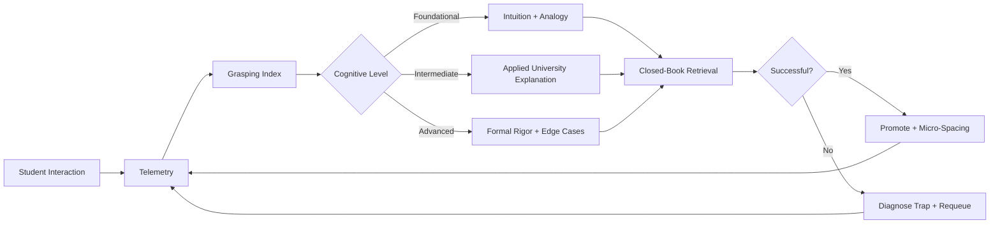
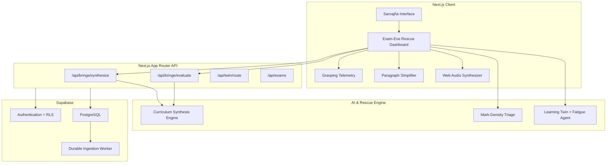
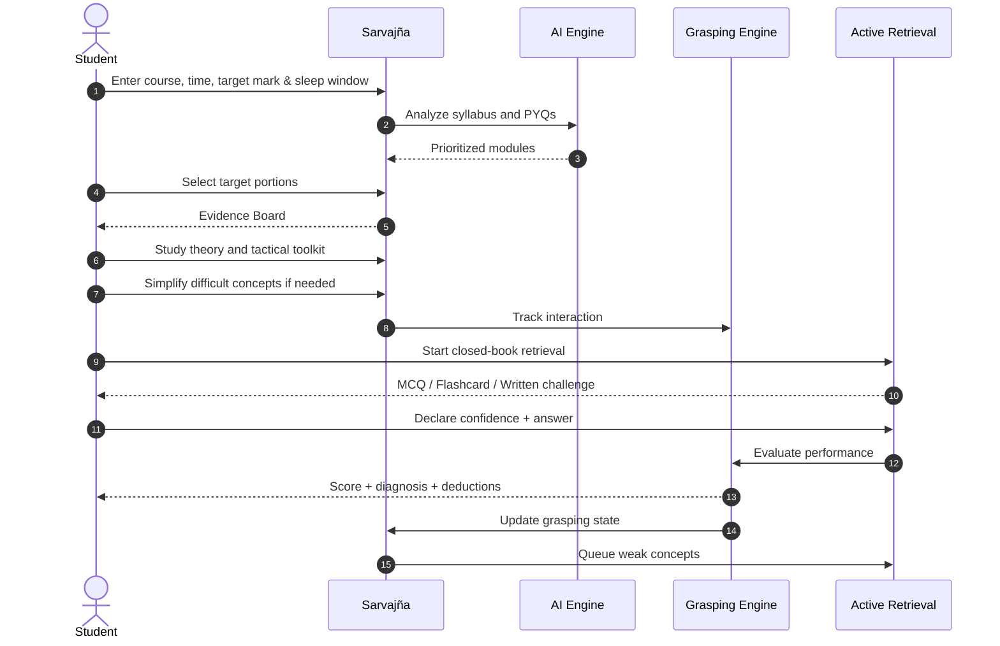

# Sarvajña — The Ultimate exam passer

> **An AI-directed cognitive rescue system for students who have hours left, not weeks.**

Sarvajña is an adaptive, evidence-based learning operating system built for **high-stakes, last-minute university exam preparation**. Instead of generating endless notes, it identifies the highest-yield portions of a syllabus, estimates how well a student is actually grasping them, adapts explanations to their cognitive level, forces closed-book retrieval, diagnoses examiner traps, and protects time for memory consolidation.

The core idea is simple:

**Don't study everything. Study what matters, learn it at the level you can actually grasp, prove that you can retrieve it, and protect the sleep that makes it stick.**

---

## Overview

Traditional exam preparation assumes students have enough time to work through an entire curriculum. Or they have already predefined what to teach student at last minute, but every student is different soo one comman teaching at the last moment will only hinder them.
Instead we deliever the resource according to the grasping power of each individual soo separate teaching and exam prepration for each students at the final moments.

The system combines:

- Real-time grasping telemetry
- AI-powered curriculum synthesis
- Mark-density topic prioritization
- Closed-book active recall
- Confidence calibration
- Fatigue and focus detection
- AI-evaluated written answers
- Past-question analysis
- Multilingual simplification
- Sleep-protected scheduling
- A final emergency survival sheet

Rather than treating every topic equally, Sarvajña continuously asks:

> **"Given this student's current knowledge, available time, target score, and remaining sleep window — what should they learn next?"**

---

## Problem Statement

The final night before an examination creates a unique learning crisis.

Students often respond by:

- Re-reading hundreds of pages
- Watching lectures at accelerated speeds
- Highlighting everything
- Jumping randomly between topics
- Studying topics they already understand
- Ignoring weak areas until too late
- Mistaking recognition for actual recall
- Sacrificing sleep for more study hours

This creates an **illusion of competence**: a student may recognize an answer while looking at notes but fail to reproduce it under closed-book examination conditions.

The problem is therefore not simply:

> **"How can AI teach students?"**

It is:

> **"How can AI make the best possible learning decisions for a student when time, attention, and cognitive capacity are severely constrained?"**

---

## Solution

Sarvajña treats last-minute preparation as an **adaptive optimization problem**.

The system:

1. **Calibrates the exam boundary**
   - Exam countdown
   - Hours available
   - Target passing mark
   - Protected sleep requirement
   - Question style

2. **Mines the syllabus and evidence**
   - Course material
   - Past-year questions
   - Uploaded PDFs and notes
   - Professor-provided priority topics

3. **Prioritizes the syllabus**
   - Estimates expected marks
   - Estimates study time
   - Calculates mark density
   - Classifies topics into Must Know / Should Know / Skip for Now

4. **Measures real-time grasping**
   - Confidence
   - Response speed
   - Diagnostic performance
   - Written-answer accuracy
   - Consecutive errors
   - Focus stability

5. **Adapts the explanation**
   - Foundational intuition
   - University-level applied explanation
   - Advanced rigor, proofs, invariants, and edge cases

6. **Forces retrieval**
   - Closed-book questions
   - Flashcards
   - MCQs
   - Written answers
   - Confidence-before-answering

7. **Learns from failure**
   - Identifies deduction traps
   - Updates the grasping score
   - Queues weak concepts for re-testing

8. **Protects memory consolidation**
   - High-density study sprints
   - Evening consolidation
   - Protected sleep
   - Morning rapid recall

---

## The Core Loop



This creates a continuous adaptive loop rather than a static lesson.

---

## Features

### 1. Real-Time Grasping Intelligence

Sarvajña maintains a dynamic **Grasping Index from 1.0 to 10.0**.

It combines six primary signals:

- **Confidence Calibration** — compares what the student thinks they know with what they actually know.
- **Response Velocity** — identifies fragile recall through unusually slow responses.
- **Written Rubric Accuracy** — evaluates descriptive answers against marking criteria.
- **Fatigue Detection** — detects consecutive errors and latency spikes.
- **Focus Span Stability** — contracts study sprints when cognitive fatigue appears.
- **Multilingual Simplification** — converts dense academic explanations into accessible intuition.

---

### 2. Adaptive Cognitive Scaffolding

The explanation changes according to the learner's measured grasp.

| Grasping Score | Learning Tier | Strategy |
|---|---|---|
| `< 5.0` | Foundational | High-school analogy, intuition, simplified explanation |
| `5.0 – 7.8` | Intermediate | Applied university explanation, derivations, worked models |
| `≥ 7.8` | Advanced | Formal proofs, invariants, boundary cases, examiner traps |

The goal is not to permanently simplify content.

The goal is to **simplify only when necessary and restore rigor as understanding improves.**

---

### 3. Mark-Density Topic Triage

When only a few hours remain, studying every chapter equally is impossible.

Sarvajña models topic selection as a constrained knapsack optimization problem.

```text
Mark Density =
Expected Marks Gain / Required Study Minutes
```

The expected gain incorporates:

- Probability of appearance
- Average marks
- Current mastery
- Target mastery
- Estimated study complexity
- Remaining study time

This produces an actionable priority queue instead of a generic syllabus summary.

---

### 4. Pass-Threshold Planning

Sarvajña estimates expected score using a probabilistic model rather than presenting question predictions as guarantees.

```text
Pass Confidence =
Φ((Expected Score - Passing Score) / σ)
```

Where:

- `Expected Score` = expected marks from selected high-yield topics
- `σ` = estimated score variance
- `Passing Score` = student's configured target
- `Φ` = Gaussian cumulative distribution function

The system labels these as **statistical estimates**, not guaranteed outcomes.

---

### 5. Interactive Portion Selection

Before entering deep study mode, students can select exactly what they want to cover.

Each module can expose:

- Predicted marks
- Estimated study time
- Recurrence frequency
- Priority tier
- Current progress
- Contribution toward the target threshold

Quick-select modes include:

- **Must-Know Only**
- **Select All Portions**
- **Reset to Core**

---

### 6. Pass-Core Evidence Board

The main study interface uses a structured two-column approach.

**Academic Derivation**

- Formal definitions
- Governing mechanisms
- Step-by-step derivations
- Problem formulations
- University-level explanations

**Tactical Exam Toolkit**

- Intuitive mental models
- Everyday analogies
- Essential formulas
- Boundary conditions
- Examiner traps
- Keywords required for marks

This separates **understanding the concept** from **knowing how to score with it**.

---

### 7. AI Paragraph Simplifier

When a learner struggles with dense academic language, Sarvajña can provide simplified intuition through the `ParagraphSimplifier`.

Supported languages:

- English
- Hindi
- Telugu
- Tamil
- Malayalam
- Bengali
- Spanish
- French
- German

The simplifier is designed as a support layer rather than a replacement for academic rigor.

---

### 8. Active Retrieval Practice

Sarvajña deliberately hides the answer before retrieval.

Practice modes include:

- MCQs
- Flashcards
- Written answers
- Closed-book recall
- Past-year questions

Students must also declare confidence **before** seeing the solution, helping expose dangerous cases where confidence is high but actual performance is low.

---

### 9. AI-Evaluated Written Answers

Students can submit descriptive answers and receive structured evaluation based on:

- Required keywords
- Marking criteria
- Structural logic
- Correct mechanisms
- Missing concepts
- Deduction traps
- Expected marks
- Exam-ready model answers

---

### 10. University PYQ Intelligence

Past-year questions are treated as evidence rather than decoration.

Sarvajña can organize:

- Multi-year university questions
- Worked solutions
- Marking-point breakdowns
- Recurring concepts
- Question-style patterns

---

### 11. Micro-Spacing Queue

A missed question does not simply disappear.

Weak concepts are automatically queued for later retrieval:

```text
Miss → Diagnose → Requeue → Retrieve → Re-evaluate
```

This queue feeds the evening consolidation session and morning rapid-recall session.

---

### 12. Emergency Survival Sheet

Before entering the examination hall, students can access a compact one-page summary containing:

- High-yield formulas
- Core definitions
- Critical mechanisms
- Examiner pitfalls
- Essential keywords

It is designed for the **final 30-minute recall sweep**.

---

### 13. Sleep-Protected Rescue Schedule

Sarvajña deliberately refuses to treat sleep as wasted study time.

The default rescue schedule is structured into four phases:

```text
Phase 1 → 3–4h High-Density Retrieval
Phase 2 → 30m Evening Consolidation
Phase 3 → 6h Protected Sleep
Phase 4 → 30m Morning Rapid Recall
```

The schedule prioritizes retention instead of maximizing raw study hours.

---

### 14. Cognitive-Calm Interface

The UI is intentionally designed for late-night, high-stress study.

Design principles include:

- Zero-emoji interface
- Deep obsidian dark mode
- Forest/emerald accents
- Eye-comfortable light mode
- Serif academic headings
- Clean sans-serif body text
- Monospace telemetry tags
- SVG interface icons
- Minimal distraction
- Procedural Web Audio feedback

---

## System Architecture



---

## Exam-Eve Rescue Workflow



---

## Tech Stack

### Frontend

- **Next.js**
- **React**
- **TypeScript**
- CSS design system
- `lucide-react` vector icons
- Web Audio API

### Backend

- **Next.js App Router**
- Route handlers / API endpoints
- Structured AI completion layer
- Background document ingestion worker

### Database

- **PostgreSQL**
- **Supabase**
- Supabase Authentication
- Row-Level Security (RLS)
- SQL migrations

### AI / APIs / Services

- OpenAI-compatible AI API layer
- Configurable provider support:
  - OpenAI
  - Gemini
  - Groq
  - Local Ollama
- AI curriculum synthesis
- Written-answer evaluation
- Multilingual simplification
- Behavioral analysis

### Mathematical / Intelligence Layer

- Mark-density optimization
- Constrained knapsack model
- Gaussian CDF
- Error function (`erf`)
- Exponential moving average
- Cognitive telemetry
- Fatigue detection

### Hosting / Deployment

The project is structured for deployment as a **Next.js application**, with Supabase providing cloud authentication and PostgreSQL infrastructure when persistent cloud functionality is enabled.

### Other Tools

- TypeScript strict mode
- Zod schema validation
- Mermaid architecture diagrams
- Git / GitHub
- Background ingestion worker
- PDF / TXT / Markdown document ingestion

---

## Codex / OpenAI Usage

AI was used as a core development accelerator throughout the project.

### Ideation

AI helped transform the initial idea of an adaptive learning assistant into a concrete **Exam-Eve Cognitive Rescue System**, including the concepts of:

- Grasping telemetry
- Cognitive scaffolding
- Mark-density prioritization
- Closed-book retrieval
- Learning Twin behavior modeling
- Sleep-protected scheduling

### Architecture Planning

AI-assisted reasoning was used to structure the application into:

- Client interface
- AI synthesis engine
- Rescue optimization engine
- Behavioral telemetry layer
- API routes
- Supabase storage
- Background ingestion

### Code Generation

AI assistance was used to accelerate development of:

- React / Next.js components
- TypeScript services
- API routes
- Learning telemetry logic
- Adaptive study flows
- UI components
- Structured AI completion handling

### Debugging

AI helped analyze implementation problems, reason through TypeScript/application architecture issues, and iterate on the interaction between the frontend, AI layer, API routes, and persistence layer.

### AI Integration

AI was integrated into the product itself for:

- Curriculum synthesis
- Academic explanation
- Paragraph simplification
- Written-answer evaluation
- Diagnostic feedback
- Learning adaptation

### UI / UX Development

AI-assisted design iteration helped shape the cognitive-calm interface, including:

- Dual themes
- Evidence Board
- Portion Selection Modal
- Closed-book Practice Lab
- Emergency Survival Sheet
- Telemetry presentation
- Zero-emoji design system

### Documentation

AI was also used to structure technical documentation, architecture diagrams, feature descriptions, setup instructions, and project communication.

**The important distinction:** AI was not only used to build Sarvajña; AI is part of Sarvajña's actual learning engine.

---

## Demo

### Live Demo

**Add deployed project link here.**

> `https://your-deployment-url.example`

### Demo / Pitch Video

**Add demo or pitch video link here.**

> `https://your-video-link.example`

### Suggested Demo Flow

For a short hackathon demo, show:

1. Student enters an upcoming exam and available hours.
2. Sarvajña analyzes the syllabus / PYQs.
3. High-yield portions appear with marks and time estimates.
4. Student selects the target portions.
5. Evidence Board generates the academic + tactical view.
6. Student simplifies a difficult concept.
7. Student enters Closed-Book Practice.
8. Student declares confidence before answering.
9. Sarvajña evaluates the response.
10. Grasping score changes based on performance.
11. Weak topics enter the micro-spacing queue.
12. The system generates the final rescue schedule and survival sheet.

---

## Screenshots

Add project screenshots here.

```text
docs/
└── screenshots/
    ├── dashboard.png
    ├── portion-selection.png
    ├── evidence-board.png
    ├── active-practice.png
    ├── grasping-telemetry.png
    └── survival-sheet.png
```

Example Markdown:

```markdown


```

---

## How to Run Locally

### Prerequisites

- Node.js `18.17+` or Node.js `20+`
- npm `9+` or pnpm
- Supabase account — optional for local mock/demo mode
- AI API key — depending on the configured provider

### 1. Clone the Repository

```bash
git clone https://github.com/kashyapdayal/Sarvajna.git
cd Sarvajna
```

### 2. Install Dependencies

```bash
npm install
```

### 3. Configure Environment Variables

Copy the example environment file:

```bash
cp .env.example .env.local
```

Configure the required variables:

```env
# Optional Supabase Cloud Database & Authentication
NEXT_PUBLIC_SUPABASE_URL=your_supabase_project_url
NEXT_PUBLIC_SUPABASE_ANON_KEY=your_supabase_anon_key
SUPABASE_SERVICE_ROLE_KEY=your_supabase_service_role_key

# AI Provider Configuration
AI_API_KEY=your_api_key_here
AI_BASE_URL=https://generative-language.googleapis.com/v1beta/openai/
AI_MODEL=gemini-1.5-flash
```

### 4. Start the Development Server

```bash
npm run dev
```

Open:

```text
http://localhost:3000
```

### 5. Run the Integrated Background Worker

To run the Next.js server together with the document ingestion worker:

```bash
./scripts/start.sh
```

Stop the background processes with:

```bash
./scripts/stop.sh
```

---

## Project Structure

```text
Sarvajna/
├── public/
│   └── logo.png
│
├── src/
│   ├── app/
│   │   ├── api/
│   │   │   ├── bringe/
│   │   │   │   ├── evaluate/
│   │   │   │   └── synthesize/
│   │   │   ├── attempts/
│   │   │   ├── behavior/
│   │   │   ├── exams/
│   │   │   └── twin/
│   │   ├── globals.css
│   │   ├── layout.tsx
│   │   └── page.tsx
│   │
│   ├── components/
│   │   ├── bringe/
│   │   │   └── BringeStudyRescue.tsx
│   │   ├── common/
│   │   │   ├── ParagraphSimplifier.tsx
│   │   │   └── SoundEffects.ts
│   │   ├── navigation/
│   │   │   ├── AppSidebar.tsx
│   │   │   └── FloatingDock.tsx
│   │   ├── rescue/
│   │   │   ├── ActiveStudyRunner.tsx
│   │   │   ├── CheatSheetModal.tsx
│   │   │   └── PanicModeOverlay.tsx
│   │   └── study-path/
│   │       ├── AdaptivePath.tsx
│   │       └── GamifiedStudyPath.tsx
│   │
│   └── lib/
│       ├── bringe-ai-engine.ts
│       ├── grasping-service.ts
│       ├── rescue-engine.ts
│       ├── behavior-agent.ts
│       ├── ai.ts
│       └── config.ts
│
├── docs/
│   ├── backend-setup.md
│   └── decisions.md
│
├── supabase/
│   └── migrations/
│
├── package.json
├── tsconfig.json
└── README.md
```

---

## Safety & Content Integrity

Sarvajña is designed to reduce misleading certainty during high-stakes preparation.

### No Guaranteed Questions

Predictions are presented as **statistical estimates**, not guaranteed exam questions.

### Evidence-Anchored Synthesis

AI-generated academic content is designed to be anchored to:

- Syllabus definitions
- Past university question patterns
- Uploaded evidence
- Curated academic resources

### Structured Outputs

Zod validation is used to ensure AI API responses conform to expected schemas.

### Cognitive Calm

The interface intentionally avoids unnecessary:

- Flashing animations
- Distracting graphics
- Emoji-heavy notifications
- Excessive visual noise

The product is designed around the principle that the interface itself should not become another source of cognitive load.

---

## What Makes Sarvajña Different?

Most AI learning tools answer:

> **"What do you want to learn?"**

Sarvajña asks:

> **"What can you realistically learn, retrieve, and retain before your exam?"**

Most study tools optimize for **content delivery**.

Sarvajña optimizes for:

```text
TIME
  ↓
PRIORITY
  ↓
UNDERSTANDING
  ↓
RETRIEVAL
  ↓
DIAGNOSIS
  ↓
REINFORCEMENT
  ↓
SLEEP
  ↓
EXAM READINESS
```

It is not another AI note generator.

It is an **adaptive decision engine for the final hours before an exam.**

---

## Roadmap

Potential future extensions include:

- More university-specific marking-rubric integrations
- Better longitudinal Learning Twin modeling
- More evidence sources and academic databases
- Offline-first emergency study mode
- Native mobile application
- More language support
- Advanced exam-pattern analytics
- Personalized long-term study paths
- Instructor / university dashboards
- More sophisticated calibration of pass-confidence estimates

---

## Additional Notes

Sarvajña is currently optimized around the **exam-eve / last-minute preparation scenario**.

Some components may operate in demo or mock mode when Supabase or an external AI provider is not configured.

The probabilistic pass-confidence system should be interpreted as a planning aid rather than a guarantee of examination performance.

The project's architecture also supports longer-term adaptive learning through the Learning Twin and study-path components, but the central product experience is intentionally focused on the **last-mile problem: making the remaining study time count.**

---

## Philosophy

> **You don't need more content.**
>
> **You need better decisions about what to learn, proof that you can retrieve it, and enough sleep to remember it.**

**Sarvajña** — *Turn the last few hours into the right hours.*
